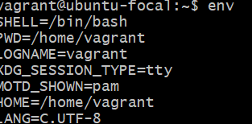
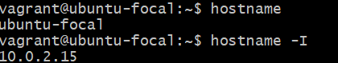

## 10 linux commands and description 
- ls -R - Lists files in sub-directories as well 

- history -G ives a list of all past commands typed in the current terminal session

- apt-get - Command used to install and update packages

- env - list all environment variable

- hostname - Show system host name

- hostname -I - Display all local IP addresses of the host.

- df -h - Show free and used space on mounted filesystems

- df -i - Show free and used inodes on mounted filesystems

- locate name - Find files and directories by name

- ip a - Display all network interfaces and IP address
