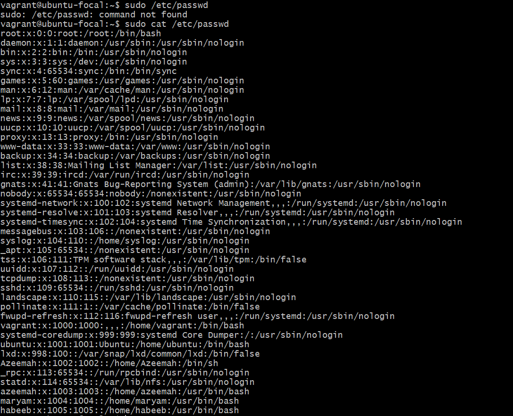
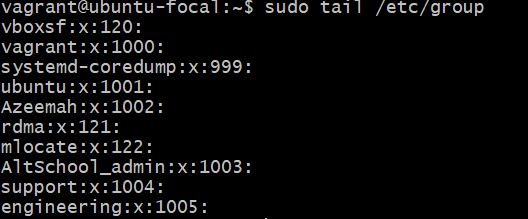
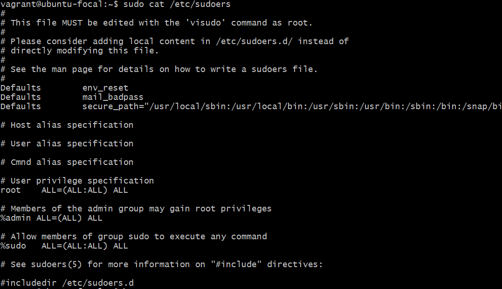

## Managing users and groups, file permissions ,SSH.
- Create 3 groups – admin, support & engineering `sudo groupadd groupname`

- add the admin group to sudoers `sudo visudo -f /etc/sudoers.d/admin`

- Create a user in each of the groups. `sudo useradd -g groupname username`

- Generate SSH keys for the user in the admin group `ssh-keygen`

- `sudo cat /etc/passwd`

- `sudo cat /etc/group`

- `sudo cat /etc/sudoers`

